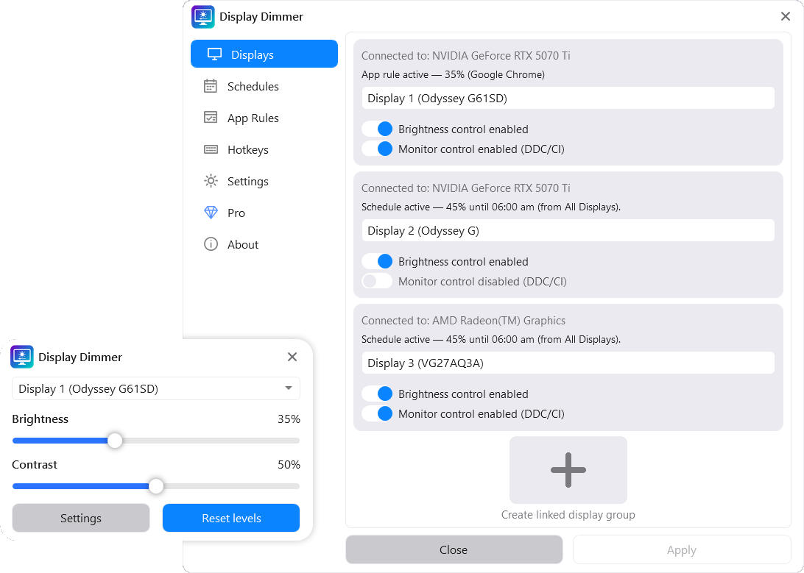

# Display Dimmer

**Official GitHub repository for Display Dimmer by Vantari Works.**

Display Dimmer is a Windows 10 and Windows 11 app for controlling monitor brightness and contrast across single-monitor and multi-monitor setups. It uses DDC/CI hardware controls where supported and can fall back to software dimming when hardware brightness control is unavailable or unreliable.

[Official website](https://displaydimmer.com/) · [Microsoft Store](https://apps.microsoft.com/detail/9NBWHFCLN6CM?cid=github) · [Releases](https://github.com/VantariWorks/display-dimmer/releases) · [Local Automation](local-automation/README.md) · [Support](https://displaydimmer.com/support)

## Windows Monitor Brightness Control

Display Dimmer provides convenient brightness and contrast controls for external monitors directly from Windows. It is designed for desktop PCs, laptops with external displays, docking stations, and other multi-monitor setups.

### Features

- Adjust brightness and contrast for external monitors
- Control individual displays or all displays together
- Preserve relative brightness levels when adjusting all displays
- Use DDC/CI hardware brightness control where supported
- Use software dimming when hardware control is unavailable or unreliable
- Enable or disable DDC/CI separately for each display
- Create scheduled brightness rules
- Create app-based and fullscreen app rules
- Use global hotkeys for brightness, contrast, and display actions
- Use supported physical brightness keys
- Use CLI and local automation with PowerShell, AutoHotkey, Task Scheduler, Stream Deck, and other tools
- Start with Windows and reapply brightness on launch
- Run quietly from the Windows system tray
- Choose from light, dark, system, and additional Pro themes

## DDC/CI and Software Dimming

Display Dimmer supports DDC/CI monitor control where available. DDC/CI allows Windows software to adjust a monitor's hardware brightness and contrast settings directly.

DDC/CI support depends on the monitor, cable, dock, adapter, GPU, and display configuration. Some monitors require DDC/CI to be enabled in the monitor's built-in menu, while some displays do not support hardware brightness control at all.

When DDC/CI is unavailable, disabled, unsupported, or unreliable for a specific display, Display Dimmer can use software dimming instead. DDC/CI can also be enabled or disabled separately for each monitor.

## Brightness Automation

Display Dimmer can adjust monitor brightness automatically based on the time of day or the app you are using.

Schedules are useful for day and night brightness changes. App rules are useful for games, video players, design tools, presentations, and other programs that benefit from a different brightness level.

When an automation rule ends, Display Dimmer restores the previous brightness level so the display setup remains predictable.

## Global Hotkeys and Brightness Keys

Global hotkeys can adjust brightness, contrast, and display settings without opening the main app window.

Display Dimmer also supports physical brightness keys on compatible keyboards and devices.

## Local Automation

Display Dimmer Pro can be controlled locally from PowerShell, AutoHotkey, Task Scheduler, Stream Deck, Arduino sensor projects, and other tools.

[View the Display Dimmer Local Automation documentation and examples](local-automation/README.md)

## Display Dimmer Pro

Display Dimmer includes core monitor brightness control, basic automation, and basic hotkey support for free.

Display Dimmer Pro is an optional one-time upgrade that unlocks:

- More schedules and app rules
- More global hotkeys
- Per-display automation and hotkey targeting
- Linked display groups
- Advanced display controls
- All Pro themes

**No subscription.**

## Install Display Dimmer

Display Dimmer is available from the Microsoft Store:

[Download Display Dimmer for Windows](https://apps.microsoft.com/detail/9NBWHFCLN6CM?cid=github)

Microsoft Store product ID: `9NBWHFCLN6CM`

- [View GitHub releases](https://github.com/VantariWorks/display-dimmer/releases)
- [View the changelog](CHANGELOG.md)

## Support and Compatibility Help

For help with Display Dimmer, monitor compatibility, DDC/CI, software dimming, or other issues:

- [Display Dimmer support](https://displaydimmer.com/support)
- [Privacy policy](https://displaydimmer.com/privacy) | [PRIVACY.md](PRIVACY.md)
- Email: support@displaydimmer.com

When reporting a monitor-control issue, please include:

- Display Dimmer version
- Windows version
- Monitor model
- Connection type, such as HDMI, DisplayPort, USB-C, dock, or adapter
- GPU or graphics adapter
- Whether HDR is enabled
- Whether DDC/CI is enabled in the monitor's built-in menu
- What happened before the issue started, such as sleep or resume, reconnecting a display, changing HDR, switching ports, or using a dock

## Compatibility Notes

- Display Dimmer is currently available for Windows 10 and Windows 11.
- The app interface is currently in English.
- Hardware brightness and contrast control is limited by what the monitor and display path support.
- Software dimming is available when hardware brightness control is unavailable or unreliable.

## Repository Purpose

This repository is maintained by Vantari Works for Display Dimmer support information, release notes, local automation documentation, and other public resources.

The Display Dimmer application source code is not currently published in this repository.
