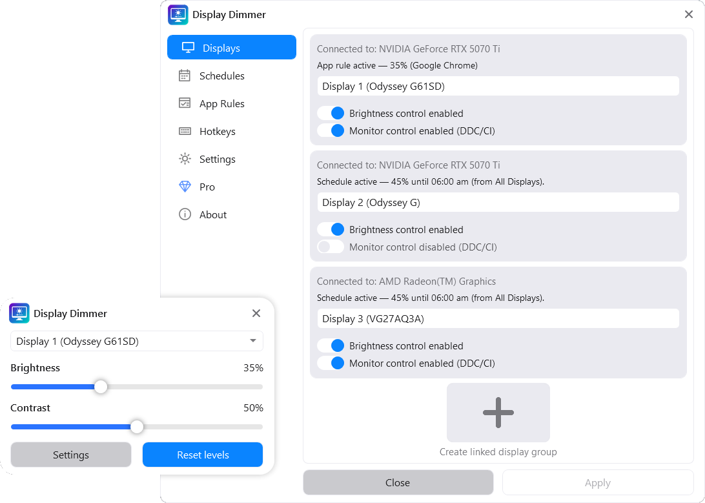

# Display Dimmer

**Official GitHub repository for Display Dimmer by Vantari Works.**

Display Dimmer is a Windows 10 and Windows 11 app for controlling monitor brightness and contrast across single-monitor and multi-monitor setups. It uses DDC/CI hardware controls where supported and can fall back to software dimming when hardware brightness control is unavailable or unreliable.

[Official website](https://displaydimmer.com/) · [Microsoft Store](https://apps.microsoft.com/detail/9NBWHFCLN6CM?cid=github) · [Releases](https://github.com/VantariWorks/display-dimmer/releases) · [Local Automation](local-automation/README.md) · [Support](https://displaydimmer.com/support)

## Windows Monitor Brightness Control

Display Dimmer provides convenient brightness and contrast controls for external monitors directly from Windows. It is designed for desktop PCs, laptops with external displays, docking stations, and other multi-monitor setups.

### Features

- Adjust brightness and contrast for external monitors
- Control individual displays or all displays together
- Preserve relative brightness levels when adjusting all displays
- Use DDC/CI hardware brightness control where supported
- Use software dimming when hardware control is unavailable or unreliable
- Adjust software contrast and preview color temperature for 30 minutes a day; Pro unlocks unlimited temperature control
- Enable or disable DDC/CI separately for each display
- Create scheduled brightness rules
- Create app-based and fullscreen app rules
- See when a manual brightness change pauses a rule and resume automation from the main window or Displays in Settings
- Browse compact schedule, app-rule, and hotkey cards that expand for editing
- Save brightness, contrast, and temperature combinations as Pro presets
- Recall presets from the main window, tray, hotkeys, schedules, app rules, or command line
- Choose which levels a custom schedule or app rule changes
- Scroll over the tray icon to adjust the selected displays in 5% steps
- Use global hotkeys for brightness, contrast, and display actions
- Use supported physical brightness keys
- Use CLI and local automation with PowerShell, AutoHotkey, Task Scheduler, Stream Deck, and other tools
- Start with Windows and reapply brightness on launch
- Run quietly from the Windows system tray
- Choose from light, dark, system, and additional Pro themes

## DDC/CI and Software Dimming

Display Dimmer supports DDC/CI monitor control where available. DDC/CI allows Windows software to adjust a monitor's hardware brightness directly; Display Dimmer's normal contrast control is software-based.

DDC/CI support depends on the monitor, cable, dock, adapter, GPU, and display configuration. Some monitors require DDC/CI to be enabled in the monitor's built-in menu, while some displays do not support hardware brightness control at all.

When DDC/CI is unavailable, disabled, unsupported, or unreliable for a specific display, Display Dimmer can use software dimming instead. DDC/CI can also be enabled or disabled separately for each monitor.

## Brightness Automation

Display Dimmer can adjust monitor brightness automatically based on the time of day or the app you are using.

Schedules are useful for day and night brightness changes. App rules are useful for games, video players, design tools, presentations, and other programs that benefit from a different brightness level.

When an automation rule ends normally, Display Dimmer restores the previous brightness level so the display setup remains predictable.

If a manual brightness adjustment interrupts an active schedule or app rule, the main window shows the interruption and offers **Resume automation**. When that interrupted session ends, Display Dimmer keeps the user's current levels and clears the interruption, allowing a later session to take control normally.

## Global Hotkeys and Brightness Keys

Global hotkeys can adjust brightness, contrast, and display settings without opening the main app window.

Display Dimmer also supports physical brightness keys on compatible keyboards and devices.

## Local Automation

Display Dimmer Pro can be controlled locally from PowerShell, AutoHotkey, Task Scheduler, Stream Deck, Arduino sensor projects, and other tools.

Display Dimmer 2.2.12 adds saved preset listing and recall to API revision 1.2, alongside guarded `--resume-automation` for returning control after a temporary brightness change. The wire protocol remains version 1. Check the running app's advertised capabilities before using each feature; an updated CLI alone does not establish support.

[View the Display Dimmer Local Automation documentation and examples](local-automation/README.md)

IT can also activate a direct-purchase Pro license with a standalone command in
the intended Windows user profile, even while the app is Free. That operation
does not require a running app or enable Local automation. See
[IT license deployment](local-automation/docs/it-license-deployment.md) and
[managed Store updates](local-automation/docs/managed-store-updates.md).

## Display Dimmer Pro

Display Dimmer includes core monitor brightness control, one All Displays
schedule, one All Displays app rule, and two All Displays hotkeys for free.

Display Dimmer Pro is an optional one-time upgrade that unlocks:

- More schedules and app rules
- More global hotkeys
- Per-display automation and hotkey targeting
- Saved display presets
- Linked display groups
- Unlimited color-temperature control and a blue light filter
- Advanced display controls
- All Pro themes
- CLI and local automation

Schedules, app rules, and hotkeys each have a 300-item safety limit; the preset
library supports up to 300 saved presets.

**No subscription.**

Existing direct-purchase Pro keys remain supported in 2.2.12, including valid
historical keys affected by removed purchase variants. Update the app before
restoring an affected key; use the same key rather than purchasing again.

## Install Display Dimmer

Display Dimmer is available from the Microsoft Store:

[Download Display Dimmer for Windows](https://apps.microsoft.com/detail/9NBWHFCLN6CM?cid=github)

Microsoft Store product ID: `9NBWHFCLN6CM`

- [View GitHub releases](https://github.com/VantariWorks/display-dimmer/releases)
- [View the changelog](CHANGELOG.md)

## Support and Compatibility Help

For help with Display Dimmer, monitor compatibility, DDC/CI, software dimming, or other issues:

- [Display Dimmer support](https://displaydimmer.com/support)
- [Privacy policy](https://displaydimmer.com/privacy) | [PRIVACY.md](PRIVACY.md)
- Email: support@displaydimmer.com

When reporting a monitor-control issue, please include:

- Display Dimmer version
- Windows version
- Monitor model
- Connection type, such as HDMI, DisplayPort, USB-C, dock, or adapter
- GPU or graphics adapter
- Whether HDR is enabled
- Whether DDC/CI is enabled in the monitor's built-in menu
- What happened before the issue started, such as sleep or resume, reconnecting a display, changing HDR, switching ports, or using a dock

## Compatibility Notes

- Display Dimmer is currently available for Windows 10 and Windows 11.
- The app interface is currently in English.
- Hardware brightness and advanced raw VCP controls depend on the monitor and display path. The app's normal contrast control is software-based.
- Software dimming is available when hardware brightness control is unavailable or unreliable.

## Repository Purpose

This repository is maintained by Vantari Works for Display Dimmer support information, release notes, local automation documentation, and other public resources.

The Display Dimmer application source code is not currently published in this repository.
