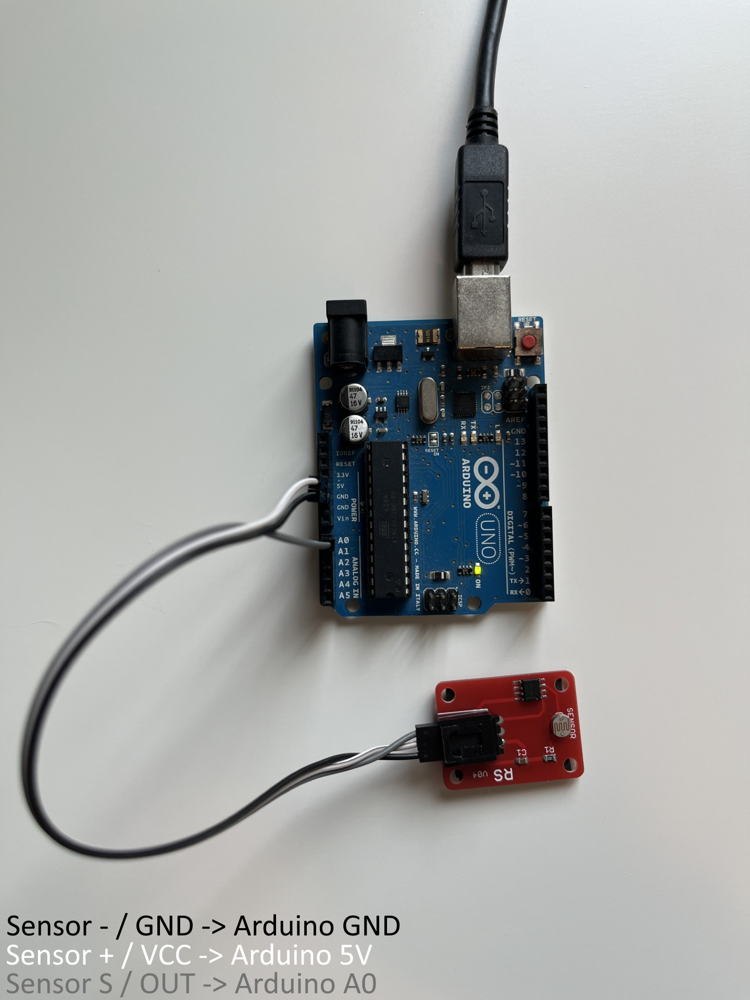

# Arduino Light Sensor Bridge

This folder contains an advanced Local automation sample for Display Dimmer.

Use it as a starting point for local hardware integrations.

It reads an analog light sensor from an Arduino Uno, converts the room-light reading into a brightness percentage, and sends live brightness commands to the running Display Dimmer app.

For the command reference, see:

[CLI/API v1 reference](../../docs/cli-api-v1.md)

The bridge handles Display Dimmer schedules and app rules, so those automations do not immediately fight the sensor.



## Contents

- [What This Does](#what-this-does)
- [Quick Start](#quick-start)
- [Folder Contents](#folder-contents)
- [Required Hardware](#required-hardware)
- [Required Software](#required-software)
- [Wiring](#wiring)
- [Upload The Arduino Sketch](#upload-the-arduino-sketch)
- [Confirm The Sensor Works](#confirm-the-sensor-works)
- [Install And Start Display Dimmer](#install-and-start-display-dimmer)
- [PowerShell Bridge Command Basics](#powershell-bridge-command-basics)
- [Which Command Should I Run?](#which-command-should-i-run)
- [Dry Run](#dry-run)
- [Live Control](#live-control)
- [Start Automatically With Windows](#start-automatically-with-windows)
- [Default Tuning](#default-tuning)
- [Calibration Process](#calibration-process)
- [How Schedules And App Rules Interact](#how-schedules-and-app-rules-interact)
- [Troubleshooting](#troubleshooting)
- [Safety Notes](#safety-notes)

## What This Does

Use this bridge to connect Display Dimmer to external automation, such as:

- a desk light sensor
- an Arduino or other microcontroller
- a home automation script
- a bias lighting controller
- a custom C# or PowerShell tool

The bridge calls Display Dimmer the same way any local script would:

```powershell
DisplayDimmer.Cli.exe --set-brightness 70 --target dd_75dd7b504e36086f --source arduino-sensor
```

By default, this only changes live brightness. It does not save brightness settings unless you explicitly add `--save`.

## Quick Start

1. Upload `ArduinoLightSensor.ino` to the Arduino.
2. Close Arduino Serial Monitor so PowerShell can use the COM port.
3. Start the Microsoft Store version of Display Dimmer.
4. Open Display Dimmer > Settings > General > Advanced > Local automation > Manage..., unlock Pro if prompted, and turn on Local automation.
5. Run `DisplayDimmer.Cli.exe --list-displays` and copy the `targetId` for your display. Prefer a `dd_...` value for a bridge you plan to keep running.
6. Run the bridge in dry-run mode first:

```powershell
powershell -NoProfile -ExecutionPolicy Bypass -File ".\examples\arduino-light-sensor\Start-ArduinoLightSensorBridge.ps1" -Port COM7 -Target dd_your_stable_id -DryRun
```

When the dry-run mapping looks right, remove `-DryRun`.

## Folder Contents

```text
examples\arduino-light-sensor\
  ArduinoLightSensor\
    ArduinoLightSensor.ino
  arduino-light-sensor.png
  Start-ArduinoLightSensorBridge.ps1
  README.md
```

`ArduinoLightSensor.ino` runs on the Arduino. It reads analog pin `A0` and prints values like:

```text
raw=609
```

The sketch uses the Arduino's built-in LED for optional bridge status. No external LED is required. Pass `-DisableArduinoStatus` if you want the bridge to only read sensor values and not send status back to the Arduino.

`Start-ArduinoLightSensorBridge.ps1` runs on Windows. It reads those serial values, smooths them, maps them to brightness, calls `DisplayDimmer.Cli.exe`, and sends status back to the Arduino.

## Required Hardware

Tested with:

- Arduino Uno
- USB cable for the Arduino
- 3-pin light sensor module
- 3 female-to-male jumper wires

The tested sensor is a red module labeled with pins:

```text
-  +  S
```

It uses an LDR/photoresistor-style sensor and provides an analog signal that works well with Arduino `A0`.

## Required Software

- Arduino IDE
- Display Dimmer installed from the Microsoft Store
- Display Dimmer Pro for Local automation
- Installed `DisplayDimmer.Cli.exe` command
- PowerShell
- Running Display Dimmer app

Arduino IDE:

```text
https://www.arduino.cc/en/software
```

If Windows asks to install an Arduino/Adafruit serial driver while setting up the board, install it if it matches the board/driver package you selected in Arduino IDE.

## Wiring

Unplug the Arduino before wiring.

With the sensor end closest to you, and the pins left-to-right as:

```text
-  +  S
```

Wire it like this:

| Sensor pin | Arduino pin |
|---|---|
| `-` | `GND` |
| `+` | `5V` |
| `S` | `A0` |

Use `A0` for this bridge.

`D2` can be used for a basic covered/uncovered digital test, but it only gives `0` or `1`. For smooth brightness control, use `A0` because it returns analog values from `0` to `1023`.

## Upload The Arduino Sketch

1. Open Arduino IDE.
2. Open:

```text
examples\arduino-light-sensor\ArduinoLightSensor\ArduinoLightSensor.ino
```

3. Select the board:

```text
Tools -> Board -> Arduino AVR Boards -> Arduino Uno
```

4. Select the port:

```text
Tools -> Port -> your Arduino COM port, such as COM7
```

Choose whichever COM port appears for the Arduino. It may be `COM3`, `COM4`, `COM7`, or something else.

5. Click Upload.

The sketch uses the built-in Arduino LED:

| LED | Meaning |
|---|---|
| Off | bridge idle/stopped |
| Solid on | sensor bridge active |
| Slow blink | Display Dimmer schedule/app rule is in control; sensor is standing by |
| Fast blink | bridge command failed |

No extra LED wiring is required for this status indicator.

## Confirm The Sensor Works

In Arduino IDE, open:

```text
Tools -> Serial Monitor
```

Set baud rate to:

```text
9600
```

Expected output:

```text
raw=609
raw=610
raw=608
```

Cover the sensor and shine a flashlight on it. The value should change.

Known readings from the first tested sensor:

| Condition | Approx raw value |
|---|---:|
| covered tightly | `0-25` |
| hand over sensor | `300-350` |
| room light / dim outside | `600-610` |
| flashlight | `750-760` |

Close Arduino Serial Monitor before running the PowerShell bridge. Only one program can read the COM port at a time.

## Install And Start Display Dimmer

Install or update Display Dimmer from the Microsoft Store, then start Display Dimmer from the Start menu or tray.

Open Display Dimmer > Settings > General > Advanced > Local automation > Manage..., unlock Pro if prompted, and turn on Local automation.

Open PowerShell and confirm the Display Dimmer command-line tool is available:

```powershell
DisplayDimmer.Cli.exe --list-displays
```

Example output:

```text
2 display(s):
  dd_75dd7b504e36086f | Display 1 (Odyssey G61SD) | session=display_1 | brightness=84 | contrast=50 | mode=software | automationInterrupted=false
    set: DisplayDimmer.Cli.exe --set-brightness 70 --target dd_75dd7b504e36086f
    json: DisplayDimmer.Cli.exe --set-brightness 70 --target dd_75dd7b504e36086f --json
```

Use the `targetId` shown by `--list-displays`, such as `dd_75dd7b504e36086f`. `display_1` is fine for a quick test, but it is session-only. For anything you plan to keep, prefer a `dd_...` target ID.

## PowerShell Bridge Command Basics

Replace `COM7` in these examples with the Arduino port shown in Arduino IDE under Tools > Port. Your Arduino might be `COM3`, `COM4`, `COM7`, or another value.

The PowerShell bridge script uses PowerShell parameters with one dash:

```powershell
-Port COM7 -Target dd_your_stable_id -DryRun
```

`DisplayDimmer.Cli.exe` uses command-line options with two dashes:

```powershell
--target dd_your_stable_id --json
```

Do not pass `--target all` to the `.ps1` bridge script. Use `-Target all`.

The safest form is:

```powershell
powershell -NoProfile -ExecutionPolicy Bypass -File ".\examples\arduino-light-sensor\Start-ArduinoLightSensorBridge.ps1" -Port COM7 -Target dd_your_stable_id
```

If you are already in PowerShell and have allowed script execution for the current session, you can also run the script directly with the call operator:

```powershell
& ".\examples\arduino-light-sensor\Start-ArduinoLightSensorBridge.ps1" -Port COM7 -Target dd_your_stable_id
```

Double-clicking the `.ps1` file is not recommended. The window may close immediately, and execution policy or working-directory issues can hide the error.

For automatic startup, use Task Scheduler to run `powershell.exe` with the same `-File ... -Port ... -Target ...` arguments.

## Which Command Should I Run?

Installed app, dry run:

```powershell
powershell -NoProfile -ExecutionPolicy Bypass -File ".\examples\arduino-light-sensor\Start-ArduinoLightSensorBridge.ps1" -Port COM7 -Target dd_your_stable_id -DryRun
```

Installed app, live control:

```powershell
powershell -NoProfile -ExecutionPolicy Bypass -File ".\examples\arduino-light-sensor\Start-ArduinoLightSensorBridge.ps1" -Port COM7 -Target dd_your_stable_id
```

All displays:

```powershell
powershell -NoProfile -ExecutionPolicy Bypass -File ".\examples\arduino-light-sensor\Start-ArduinoLightSensorBridge.ps1" -Port COM7 -Target all
```

Source checkout or local build testing:

```powershell
powershell -NoProfile -ExecutionPolicy Bypass -File ".\examples\arduino-light-sensor\Start-ArduinoLightSensorBridge.ps1" -Port COM7 -Target dd_your_stable_id -CliPath $cli
```

For source checkout testing, start the rebuilt Display Dimmer app first and set `$cli` to the matching rebuilt `DisplayDimmer.Cli.exe` path.

## Dry Run

Dry-run mode reads the sensor and prints the brightness it would send, but does not change the monitor.

```powershell
powershell -NoProfile -ExecutionPolicy Bypass -File ".\examples\arduino-light-sensor\Start-ArduinoLightSensorBridge.ps1" -Port COM7 -Target dd_75dd7b504e36086f -DryRun
```

Expected output:

```text
Opening COM7 at 9600 baud.
Target=dd_75dd7b504e36086f RawDark=10 RawBright=760 Brightness=20-80 Step=2 Threshold=5 ReassertThreshold=1 IntervalMs=200 AutomationPollMs=500 Source=arduino-sensor DryRun=True IgnoreAutomationResume=False PauseOnManualChange=False ManualPauseSeconds=0 DisableArduinoStatus=False
raw=557 smooth=557 brightness=78 dry-run
raw=552 smooth=556 brightness=78 skipped
raw=320 smooth=509 brightness=74 dry-run
```

`skipped` means the brightness change was too small or too soon to send. This is intentional and prevents noisy sensor readings from sending too many commands.

Stop the bridge with:

```text
Ctrl+C
```

## Live Control

Start Display Dimmer from the Start menu or tray, then run:

```powershell
powershell -NoProfile -ExecutionPolicy Bypass -File ".\examples\arduino-light-sensor\Start-ArduinoLightSensorBridge.ps1" -Port COM7 -Target dd_75dd7b504e36086f
```

The script will call Display Dimmer like this:

```powershell
DisplayDimmer.Cli.exe --set-brightness 80 --target dd_75dd7b504e36086f --source arduino-sensor
```

When a schedule or app rule is currently in control, the script switches to a non-applying heartbeat:

```powershell
DisplayDimmer.Cli.exe --update-external-brightness 80 --target dd_75dd7b504e36086f --source arduino-sensor
```

That heartbeat keeps the latest sensor value fresh without interrupting Display Dimmer automation.

Expected behavior:

- brighter room -> higher monitor brightness
- darker room -> lower monitor brightness
- small sensor noise -> skipped
- repeated commands -> handled one at a time by Display Dimmer's local automation path
- schedule/app-rule fighting -> controlled by a standby/resume loop

By default, the bridge stays running and ready:

- when started, the sensor sends brightness and takes control
- if a schedule or app rule is resumed for the selected display, the bridge enters standby for that display
- if `-Target all` is used, displays owned by schedules/app rules stand by while the other displays keep following the sensor
- while a display is in standby, the bridge keeps reading the sensor and refreshes the latest desired value with `--update-external-brightness`
- when the active schedule/app rule ends, Display Dimmer can hand off directly to the current sensor value
- if the main slider changes brightness while the sensor is active, the bridge reasserts the current sensor value after the next state poll

To make the sensor ignore automation and always keep sending brightness commands, use manual override mode:

```powershell
-IgnoreAutomationResume -Source cli
```

### Which Live Command Should I Use?

Use the normal command when the light sensor should cooperate with Display Dimmer schedules and app rules:

```powershell
powershell -NoProfile -ExecutionPolicy Bypass -File ".\examples\arduino-light-sensor\Start-ArduinoLightSensorBridge.ps1" -Port COM7 -Target dd_75dd7b504e36086f
```

With the normal command:

- the bridge uses a named cooperative source, `arduino-sensor`
- if no schedule or app rule owns the display, the sensor applies brightness immediately
- if a schedule or app rule owns the display, the bridge stands by for that display
- if `-Target all` is used, displays owned by schedules/app rules stand by while the other displays keep following the sensor
- the bridge stays running while it is standing by
- while standing by, the bridge sends non-applying `--update-external-brightness` heartbeats
- once the schedule/app rule ends, Display Dimmer can hand off to the current sensor value without a manual-baseline flicker
- if something else changes live brightness while the sensor is active, the bridge reasserts the sensor value unless `-PauseOnManualChange` is used

`dd_...` target IDs from Display Dimmer's CLI list are based on Display Dimmer's stable display identity. `display_1` and `display_2` are session aliases and are weaker for scripts you plan to keep.

For quick tests, `-Target primary` follows the current Windows primary display. For a bridge you plan to leave running, prefer a `dd_...` target ID.

If you want moving the Display Dimmer brightness slider to interrupt the sensor, add:

```powershell
-PauseOnManualChange
```

Example:

```powershell
powershell -NoProfile -ExecutionPolicy Bypass -File ".\examples\arduino-light-sensor\Start-ArduinoLightSensorBridge.ps1" -Port COM7 -Target dd_75dd7b504e36086f -PauseOnManualChange
```

With `-PauseOnManualChange`, the bridge keeps reading the sensor but stops sending brightness commands when it sees live Display Dimmer brightness differ from the last brightness the bridge successfully sent. Normal sensor changes do not count as manual interruption. Stop and restart the bridge when you want the sensor to take over again.

It also applies while Display Dimmer automation is in control. For example:

1. Sensor is active.
2. An app rule takes over, so the bridge enters standby.
3. You drag the Display Dimmer brightness slider.
4. The app rule becomes manually interrupted.
5. The bridge treats that as manual control and pauses instead of resuming the sensor.

If you want a temporary manual pause instead:

```powershell
powershell -NoProfile -ExecutionPolicy Bypass -File ".\examples\arduino-light-sensor\Start-ArduinoLightSensorBridge.ps1" -Port COM7 -Target dd_75dd7b504e36086f -PauseOnManualChange -ManualPauseSeconds 60
```

That gives the manual slider one minute of control, then the sensor resumes.

Use `-IgnoreAutomationResume` only when the sensor should always win:

```powershell
powershell -NoProfile -ExecutionPolicy Bypass -File ".\examples\arduino-light-sensor\Start-ArduinoLightSensorBridge.ps1" -Port COM7 -Target dd_75dd7b504e36086f -IgnoreAutomationResume -Source cli
```

With `-IgnoreAutomationResume`:

- the bridge uses `--source cli` and keeps sending sensor brightness commands
- clicking Apply to resume a schedule does not make that schedule take over
- clicking Apply to resume an app rule does not make that app rule take over
- the next sensor update is treated as a new manual/script override

Stop the bridge with `Ctrl+C` when you want the sensor integration fully disabled.

## Start Automatically With Windows

Use Windows Task Scheduler when you want the bridge to start every time you sign in. This is more reliable than the Startup folder because you can add a startup delay, keep the task in the same desktop session as Display Dimmer, and restart the bridge if it exits.

Before creating the task, make sure this manual command works:

```powershell
powershell -NoProfile -ExecutionPolicy Bypass -File "C:\Path\To\display-dimmer\local-automation\examples\arduino-light-sensor\Start-ArduinoLightSensorBridge.ps1" -Port COM7 -Target dd_your_stable_id
```

Recommended Task Scheduler settings:

| Setting | Value |
|---|---|
| Trigger | At log on |
| User | same Windows user that runs Display Dimmer |
| Security option | Run only when user is logged on |
| Delay task for | 30 seconds |
| Program/script | `powershell.exe` |
| Arguments | `-NoProfile -ExecutionPolicy Bypass -File "C:\Path\To\display-dimmer\local-automation\examples\arduino-light-sensor\Start-ArduinoLightSensorBridge.ps1" -Port COM7 -Target dd_your_stable_id` |
| Start in | `C:\Path\To\display-dimmer\local-automation` |
| If the task fails | restart every 1 minute, 3 times |
| If task is already running | do not start a new instance |

Do not use "Run whether user is logged on or not" for display-control tasks. Display Dimmer and the bridge need the interactive Windows user session.

After the task works, you can hide the PowerShell window by adding `-WindowStyle Hidden` before `-NoProfile`:

```text
-WindowStyle Hidden -NoProfile -ExecutionPolicy Bypass -File "C:\Path\To\display-dimmer\local-automation\examples\arduino-light-sensor\Start-ArduinoLightSensorBridge.ps1" -Port COM7 -Target dd_your_stable_id
```

If `DisplayDimmer.Cli.exe` is not available through the Windows app execution alias, pass the exact CLI path with `-CliPath`:

```text
-NoProfile -ExecutionPolicy Bypass -File "C:\Path\To\display-dimmer\local-automation\examples\arduino-light-sensor\Start-ArduinoLightSensorBridge.ps1" -Port COM7 -Target dd_your_stable_id -CliPath "C:\Path\To\DisplayDimmer.Cli.exe"
```

For startup reliability:

- Enable Display Dimmer's Start with Windows option.
- Use Display Dimmer's Start in tray option if you do not want the main window shown.
- Keep Local automation enabled.
- Keep the Arduino on the same USB port when possible so the COM port stays stable.
- Use a stable `dd_...` target ID for long-running bridges.

## Default Tuning

Current script defaults:

| Parameter | Default | Meaning |
|---|---:|---|
| `RawDark` | `10` | raw sensor value treated as darkest useful reading |
| `RawBright` | `760` | raw sensor value treated as brightest useful reading |
| `MinBrightness` | `20` | lowest brightness sent to Display Dimmer |
| `MaxBrightness` | `80` | highest brightness sent to Display Dimmer |
| `BrightnessStep` | `2` | round brightness to 2-point increments |
| `ChangeThreshold` | `5` | only send sensor-driven changes when brightness changes by at least 5 |
| `ReassertThreshold` | `1` | reassert sensor control when live Display Dimmer brightness differs from the last value the bridge successfully sent |
| `MinSendIntervalMs` | `200` | minimum quiet time after a command finishes before another brightness command is sent |
| `AutomationPollIntervalMs` | `500` | how often the bridge checks automation state, reasserts after outside changes, and refreshes standby intent |
| `Source` | `arduino-sensor` | source label sent to Display Dimmer |
| `IgnoreAutomationResume` | `false` | do not stand down when schedules or app rules are active; use with `-Source cli` for manual override behavior |
| `PauseOnManualChange` | `false` | pause sensor control when live Display Dimmer brightness differs from the last value the bridge successfully sent |
| `ManualPauseSeconds` | `0` | if greater than 0, resume sensor control after this many seconds |
| `DisableArduinoStatus` | `false` | disable status commands sent back to the Arduino LED sketch |

These defaults are responsive while keeping a safer minimum brightness. Display Dimmer can apply software/gamma brightness quickly, but external DDC/CI monitors are limited by the monitor write. For slower DDC monitors, use a larger `MinSendIntervalMs`, `BrightnessStep`, and `ChangeThreshold`.

## Useful Tuning Commands

If the monitor changes too often:

```powershell
-ChangeThreshold 10 -BrightnessStep 10
```

If the sensor is active and you want it to take back control faster after a manual slider move:

```powershell
-AutomationPollIntervalMs 250 -ReassertThreshold 1
```

If it feels too slow on a software-controlled display:

```powershell
-MinSendIntervalMs 100
```

Software/gamma dimming can usually handle `100-150` ms. DDC/CI displays are more monitor-dependent. Display Dimmer internally throttles DDC writes, but for a sensor bridge you should start around `250` ms for DDC/CI and move toward `500` ms if the monitor lags, misses writes, or reports timeouts.

If the room never gets as bright as the flashlight test:

```powershell
-RawBright 650
```

If the monitor gets too dim:

```powershell
-MinBrightness 30
```

If the monitor gets too bright:

```powershell
-MaxBrightness 85
```

Full example:

```powershell
powershell -NoProfile -ExecutionPolicy Bypass -File ".\examples\arduino-light-sensor\Start-ArduinoLightSensorBridge.ps1" -Port COM7 -Target dd_75dd7b504e36086f -RawDark 20 -RawBright 650 -MinBrightness 30 -MaxBrightness 85 -BrightnessStep 5 -ChangeThreshold 5 -MinSendIntervalMs 150
```

If you intentionally want the sensor to keep taking control even while schedules or app rules are active:

```powershell
powershell -NoProfile -ExecutionPolicy Bypass -File ".\examples\arduino-light-sensor\Start-ArduinoLightSensorBridge.ps1" -Port COM7 -Target dd_75dd7b504e36086f -IgnoreAutomationResume -Source cli
```

## Calibration Process

Use this simple process for another sensor or room:

1. Upload the Arduino sketch.
2. Open Arduino Serial Monitor at `9600`.
3. Record the raw value when the room is as dark as you want to support.
4. Record the raw value when the room is as bright as you want to support.
5. Use those as `-RawDark` and `-RawBright`.
6. Run the PowerShell bridge with `-DryRun`.
7. Tune `MinBrightness`, `MaxBrightness`, `BrightnessStep`, and `ChangeThreshold`.
8. Remove `-DryRun` when the mapping looks right.

Inverted sensor modules are supported. If the raw value gets lower as the room gets brighter, `RawBright` can be lower than `RawDark`.

Example:

```powershell
-RawDark 35 -RawBright 690 -MinBrightness 25 -MaxBrightness 90
```

## How Schedules And App Rules Interact

By default, this bridge is a cooperative external automation source. It sends live brightness commands with a named source such as `arduino-sensor`; it does not save brightness settings.

That source choice matters:

- if no schedule or app rule owns the target display, the bridge can apply the sensor brightness immediately
- if a schedule or app rule already owns the target display, the bridge stands by instead of interrupting it
- while standing by, the bridge keeps reading the sensor and sends `--update-external-brightness` heartbeats so Display Dimmer has a fresh handoff value
- when Display Dimmer automation ends, the bridge takes control again using the latest sensor value
- saved brightness changes only when `--save` is explicitly passed

You can inspect this with:

```powershell
DisplayDimmer.Cli.exe --get-state --target dd_75dd7b504e36086f --pretty
```

Treat these states as "Display Dimmer automation owns this display":

```json
{
  "scheduleActive": true,
  "scheduleInterrupted": false
}
```

```json
{
  "perAppActive": true,
  "perAppInterrupted": false
}
```

When the bridge sees one of those states, it enters standby for that display before sending another sensor brightness command. With `-Target all`, other displays can continue receiving sensor brightness commands.

```text
Display Dimmer schedule automation is in control. Sensor bridge is standing by.
```

While standing by, the bridge still reads and smooths sensor values. It also sends `--update-external-brightness` heartbeats for the standby display so Display Dimmer has a fresh handoff value. When Display Dimmer automation ends, the bridge takes control again:

```text
Display Dimmer automation ended. Sensor bridge is taking control again.
```

That prevents the bridge from immediately pausing a resumed schedule/app rule, while still keeping the sensor ready when automation releases the display. If the bridge stops or the heartbeat goes stale, Display Dimmer falls back to its normal saved/manual restore behavior.

If you intentionally want the sensor to override schedules and app rules, run with `-IgnoreAutomationResume -Source cli`. That mode behaves like moving the Display Dimmer slider or using a hotkey: it interrupts schedules and suspends app rules for the targeted displays.

## Troubleshooting

### The script says the COM port is busy

Close Arduino Serial Monitor. Only one process can read from the serial port.

Also check:

- Close Arduino Serial Plotter.
- Stop any other bridge script, terminal, VS Code/PlatformIO serial monitor, or tool using the same Arduino port.
- Replace `COM7` with the port shown in Arduino IDE under Tools > Port.
- If Arduino IDE just uploaded the sketch, wait a few seconds and run the bridge again.
- If the port stays locked, unplug/replug the Arduino and reopen PowerShell.

### Nothing prints

Check:

- Arduino is plugged in
- correct COM port is selected
- sketch was uploaded successfully
- baud rate is `9600`
- sensor `S` is connected to `A0`

### The value is always 0

Check wiring:

- sensor `-` -> Arduino `GND`
- sensor `+` -> Arduino `5V`
- sensor `S` -> Arduino `A0`

Also confirm the sketch uses:

```cpp
const int SensorPin = A0;
```

### Brightness changes in the wrong direction

Most LDR modules increase raw values as light increases, but some modules are inverted. If your module gets lower as light increases, set `RawDark` to the dark reading and `RawBright` to the bright reading anyway. The bridge supports `RawBright` being lower than `RawDark`.

### Brightness changes too often

Increase the threshold or step size:

```powershell
-ChangeThreshold 10 -BrightnessStep 10
```

### Brightness feels delayed

First check the display's control mode in `DisplayDimmer.Cli.exe --list-displays`.

For software/gamma dimming, lower the send interval:

```powershell
-MinSendIntervalMs 100
```

For DDC/CI displays, use a more conservative interval:

```powershell
-MinSendIntervalMs 250
```

If the monitor still lags, misses writes, or reports timeouts, try `500` ms and increase `BrightnessStep` or `ChangeThreshold` so the bridge sends fewer updates. The bridge waits until each CLI command finishes, then waits `MinSendIntervalMs` before sending the next brightness command. That prevents slow DDC writes from being queued back-to-back. This is separate from Display Dimmer's internal DDC throttle; software/gamma writes can usually use faster pacing.

### The CLI output does not show automation fields

The CLI is talking to a different running app version.

Update Display Dimmer from the Microsoft Store, restart Display Dimmer, and use the CLI from the same release.

Then rerun:

```powershell
DisplayDimmer.Cli.exe --get-state --target dd_75dd7b504e36086f --pretty
```

### The sensor works in dry-run but does not change brightness

Check:

- Display Dimmer is running
- target is correct, such as `dd_75dd7b504e36086f`
- `DisplayDimmer.Cli.exe --set-brightness 70 --target dd_75dd7b504e36086f` works manually
- the bridge is not running with `-DryRun`

## Safety Notes

- Use `-DryRun` first.
- Keep a reasonable `MinBrightness`; the default is `20`.
- Avoid very fast intervals on external DDC monitors. Software/gamma dimming can use shorter intervals.
- Do not use `--save` for sensor commands unless the bridge should change saved brightness settings. Sensor bridges normally send live brightness only.
- Stop the bridge with `Ctrl+C` before unplugging the Arduino.

## Current Limitations

- This is an example bridge, not a polished in-app sensor feature.
- Sensor readings are Arduino -> PowerShell -> Display Dimmer.
- Bridge status is PowerShell -> Arduino for the built-in LED indicator.
- It does not auto-detect the Arduino COM port.
- It does not persist sensor settings in Display Dimmer.
- It does not expose a UI toggle for "sensor control active" yet.
- It uses periodic command-line state checks, not the long-running `--watch --json` stream.

These are sample limitations. A finished integration could move setup into Display Dimmer itself or use Local automation/watch mode from a packaged helper tool.

