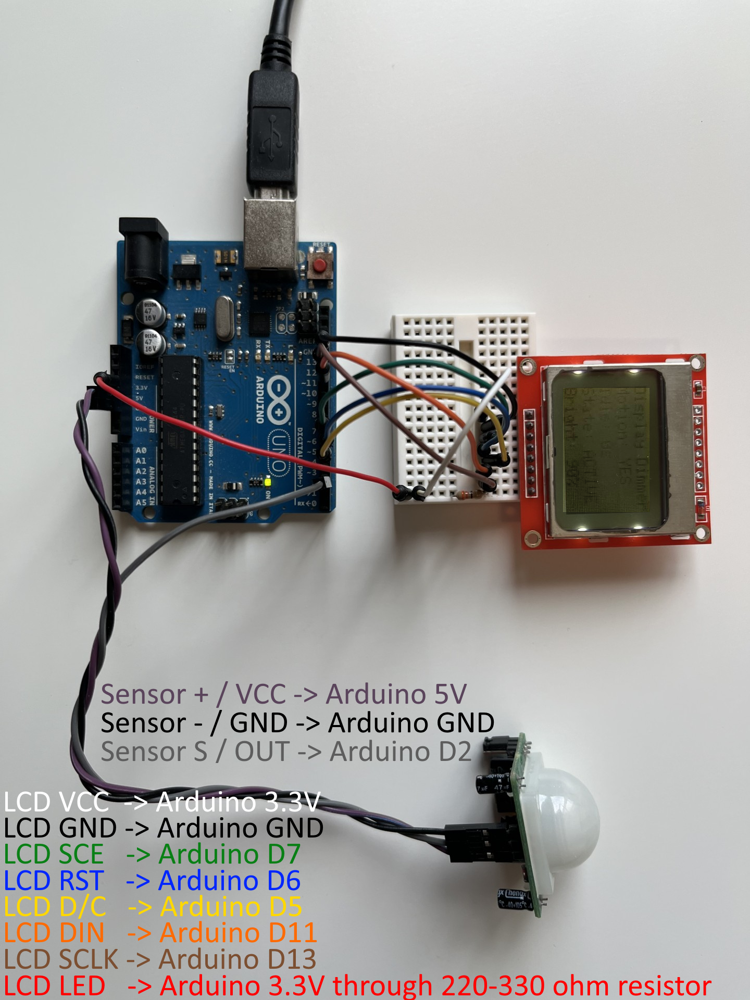

# Arduino Motion Sensor + Nokia LCD Bridge

This example is the LCD version of the Arduino motion sensor bridge.

It reads a digital motion sensor from an Arduino Uno, controls Display Dimmer from PowerShell, and sends status lines back to the Arduino so a Nokia 5110 / PCD8544 LCD can show bridge state and brightness.

Use the plain [Arduino Motion Sensor Bridge](../arduino-motion-sensor/) for motion detection without an LCD.



## Folder Contents

```text
examples\arduino-motion-sensor-lcd\
  ArduinoMotionSensorLcd\
    ArduinoMotionSensorLcd.ino
  arduino-lcd.png
  Start-ArduinoMotionSensorLcdBridge.ps1
  README.md
```

## Required Hardware

- Arduino Uno
- USB cable for the Arduino
- 3-pin PIR or digital motion sensor module
- Nokia 5110 / PCD8544 LCD module
- Jumper wires
- 220-330 ohm resistor for the LCD backlight

Install these Arduino libraries first:

```text
Adafruit GFX Library
Adafruit PCD8544 Nokia 5110 LCD Library
```

## Wiring

Suggested wiring, matching the sketch:

```text
LCD VCC  -> Arduino 3.3V
LCD GND  -> Arduino GND
LCD SCE  -> Arduino D7
LCD RST  -> Arduino D6
LCD D/C  -> Arduino D5
LCD DIN  -> Arduino D11
LCD SCLK -> Arduino D13
LCD LED  -> Arduino 3.3V through 220-330 ohm resistor

Motion sensor - / GND -> Arduino GND
Motion sensor + / VCC -> Arduino 5V
Motion sensor S / OUT -> Arduino D2
```

The LCD sketch does not control the backlight from an Arduino digital pin. Keep the backlight always on with the `LED` resistor wiring above while testing.

## Upload The Arduino Sketch

1. Open Arduino IDE.
2. Open `examples\arduino-motion-sensor-lcd\ArduinoMotionSensorLcd\ArduinoMotionSensorLcd.ino`.
3. Select `Tools > Board > Arduino Uno`.
4. Select the Arduino port under `Tools > Port`.
5. Upload the sketch.
6. Close Serial Monitor before running the PowerShell bridge.

The sketch prints the same motion lines as the plain example:

```text
motion=0
motion=1
```

It also listens for status lines from the PowerShell bridge:

```text
status=active
status=dimmed
status=standby
status=error
status=idle
brightness=20
```

The LCD bridge sends those lines automatically while the serial port is open.

## LCD Display

The LCD shows:

```text
Display Dimmer
Motion: YES/NO
Idle: seconds
State: IDLE/ACTIVE/DIMMED/STANDBY/ERROR
Bright: --
```

`Bright: --` means the Arduino has not received a `brightness=...` line yet. Start `Start-ArduinoMotionSensorLcdBridge.ps1`; after the bridge applies or restores brightness, the LCD shows the last brightness value that the bridge sent.

## Start Display Dimmer

Install or update Display Dimmer from the Microsoft Store, then start Display Dimmer from the Start menu or tray.

Open Display Dimmer > Settings > General > Advanced > Local automation > Manage..., unlock Pro if prompted, and turn on Local automation.

Open PowerShell and confirm the Display Dimmer command-line tool is available:

```powershell
DisplayDimmer.Cli.exe --list-displays
```

Pick a target ID such as:

```text
dd_75dd7b504e36086f
```

Use the `targetId` from `--list-displays`. `display_1` is fine for a quick test, but it is session-only. For anything you plan to keep, prefer a `dd_...` target ID because it is based on Display Dimmer's stable display identity.

## Which Command Should I Run?

Replace `COM7` with the Arduino port shown in Arduino IDE under Tools > Port.

Installed app, dry run:

```powershell
powershell -NoProfile -ExecutionPolicy Bypass -File ".\examples\arduino-motion-sensor-lcd\Start-ArduinoMotionSensorLcdBridge.ps1" -Port COM7 -Target dd_your_stable_id -IdleSeconds 10 -DryRun
```

Installed app, live control:

```powershell
powershell -NoProfile -ExecutionPolicy Bypass -File ".\examples\arduino-motion-sensor-lcd\Start-ArduinoMotionSensorLcdBridge.ps1" -Port COM7 -Target dd_your_stable_id
```

All displays:

```powershell
powershell -NoProfile -ExecutionPolicy Bypass -File ".\examples\arduino-motion-sensor-lcd\Start-ArduinoMotionSensorLcdBridge.ps1" -Port COM7 -Target all
```

Source checkout or local build testing:

```powershell
powershell -NoProfile -ExecutionPolicy Bypass -File ".\examples\arduino-motion-sensor-lcd\Start-ArduinoMotionSensorLcdBridge.ps1" -Port COM7 -Target dd_your_stable_id -CliPath $cli
```

PowerShell bridge scripts use one-dash parameters such as `-Port COM7` and `-Target all`. `DisplayDimmer.Cli.exe` commands use two-dash options such as `--target all`.

## Behavior

The LCD bridge uses the same motion behavior as the plain bridge:

- no motion for the idle period dims the target display
- motion restores the brightness captured before dimming
- by default, no-motion dimming acts like a manual Display Dimmer command and can interrupt schedules or app rules
- `-CooperateWithAutomation` makes the bridge stand by while a schedule or app rule owns the target

The only extra behavior is serial feedback to the Arduino LCD. The bridge always sends LCD status when the serial port is open.

## Options

| Option | Default | Purpose |
|---|---:|---|
| `Port` | `COM3` | Arduino serial port |
| `Target` | required | Display selector. Use a `dd_...` target ID from `--list-displays`, `all`, or `primary` for a quick primary-display test. |
| `BaudRate` | `9600` | Arduino serial baud rate |
| `IdleMinutes` | `2` | minutes without motion before dimming |
| `IdleSeconds` | `0` | optional seconds override for quick tests |
| `DimBrightness` | `20` | brightness to apply after idle |
| `RestoreBrightness` | `-1` | optional fixed restore brightness; `-1` means restore captured brightness |
| `AutomationPollIntervalMs` | `1000` | how often the bridge refreshes Display Dimmer state |
| `DryRun` | `false` | print behavior without calling Display Dimmer |
| `CooperateWithAutomation` | `false` | stand by while schedules or app rules own the target |
| `IgnoreAutomation` | `false` | force override behavior when also using `CooperateWithAutomation` |
| `Source` | `arduino-motion-sensor-lcd` | source label sent in cooperative mode |
| `CliPath` | auto | optional exact path to `DisplayDimmer.Cli.exe` |

## Start Automatically With Windows

Use Windows Task Scheduler when you want the LCD motion bridge to start every time you sign in.

Recommended arguments:

```text
-NoProfile -ExecutionPolicy Bypass -File "C:\Path\To\display-dimmer\local-automation\examples\arduino-motion-sensor-lcd\Start-ArduinoMotionSensorLcdBridge.ps1" -Port COM7 -Target dd_your_stable_id
```

Use "Run only when user is logged on" and run the task as the same Windows user as Display Dimmer. Display Dimmer and the bridge need the interactive Windows user session.

## Troubleshooting

### The LCD says Bright: --

Start the LCD bridge, not the plain motion bridge:

```powershell
powershell -NoProfile -ExecutionPolicy Bypass -File ".\examples\arduino-motion-sensor-lcd\Start-ArduinoMotionSensorLcdBridge.ps1" -Port COM7 -Target dd_your_stable_id
```

The plain motion bridge does not send `brightness=...` lines back to the Arduino.

### The script says the COM port is busy

Close Arduino Serial Monitor. Only one process can read from the serial port.

Also check:

- Close Arduino Serial Plotter.
- Stop any other bridge script, terminal, VS Code/PlatformIO serial monitor, or tool using the same Arduino port.
- Replace `COM7` with the port shown in Arduino IDE under Tools > Port.
- If Arduino IDE just uploaded the sketch, wait a few seconds and run the bridge again.
- If the port stays locked, unplug/replug the Arduino and reopen PowerShell.

### It never dims

Check that the script is receiving `motion=0`, Display Dimmer is running, Local automation is enabled, and the target exists.

### It always says motion detected

PIR sensors need warm-up time. Wait 30-60 seconds after plugging in the Arduino. Also check the sensor's delay/sensitivity knobs if it has them.
