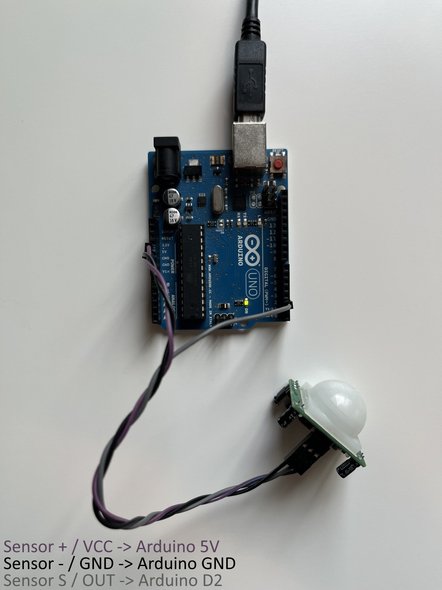

# Arduino Motion Sensor Bridge

This example reads a digital motion sensor from an Arduino Uno and controls Display Dimmer from PowerShell.

If no motion is detected for a configurable idle period, the bridge dims the selected display. When motion returns, it restores the brightness that was active before the bridge dimmed the display.

Default behavior:

```text
No motion for 2 minutes -> set brightness to 20
Motion returns          -> restore previous brightness
```

This folder is the plain motion-sensor example. It does not drive an LCD or send status lines back to the Arduino. For the Nokia LCD version, use [Arduino Motion Sensor + Nokia LCD](../arduino-motion-sensor-lcd/).



## Contents

- [Folder Contents](#folder-contents)
- [Required Hardware](#required-hardware)
- [Upload The Arduino Sketch](#upload-the-arduino-sketch)
- [Start Display Dimmer](#start-display-dimmer)
- [PowerShell Bridge Command Basics](#powershell-bridge-command-basics)
- [Which Command Should I Run?](#which-command-should-i-run)
- [Run The 2-Minute Demo](#run-the-2-minute-demo)
- [Fast Test](#fast-test)
- [Start Automatically With Windows](#start-automatically-with-windows)
- [Options](#options)
- [Automation Behavior](#automation-behavior)
- [Troubleshooting](#troubleshooting)

## Folder Contents

```text
examples\arduino-motion-sensor\
  ArduinoMotionSensor\
    ArduinoMotionSensor.ino
  arduino-motion-sensor.png
  Start-ArduinoMotionSensorBridge.ps1
  README.md
```

## Required Hardware

- Arduino Uno
- USB cable for the Arduino
- 3-pin PIR or digital motion sensor module
- 3 female-to-male jumper wires

Most 3-pin PIR modules expose pins like:

```text
GND  VCC  OUT
```

Some kits label them as:

```text
-  +  S
```

For the included sketch:

```text
Sensor - / GND -> Arduino GND
Sensor + / VCC -> Arduino 5V
Sensor S / OUT -> Arduino D2
```

PIR sensors often need 30-60 seconds to stabilize after power-on. During that warm-up they may report motion even when nothing is moving.

The bridge is one-way:

```text
Arduino -> PowerShell -> Display Dimmer
```

The Arduino prints `motion=0` or `motion=1`. The PowerShell bridge reads those lines and calls `DisplayDimmer.Cli.exe`.

## Upload The Arduino Sketch

1. Open Arduino IDE.
2. Open `examples\arduino-motion-sensor\ArduinoMotionSensor\ArduinoMotionSensor.ino`.
3. Select `Tools > Board > Arduino Uno`.
4. Select the Arduino port under `Tools > Port`.
5. Upload the sketch.
6. Optional: open Serial Monitor at `9600` baud. You should see:

```text
motion=0
motion=1
```

Close Serial Monitor before running the PowerShell bridge. Only one program can use the COM port at a time.

## Start Display Dimmer

Install or update Display Dimmer from the Microsoft Store, then start Display Dimmer from the Start menu or tray.

Open Display Dimmer > Settings > General > Advanced > Local automation > Manage..., unlock Pro if prompted, and turn on Local automation.

Open PowerShell and confirm the Display Dimmer command-line tool is available:

```powershell
DisplayDimmer.Cli.exe --list-displays
```

Pick a target ID such as:

```text
dd_75dd7b504e36086f
```

Use the `targetId` from `--list-displays`. `display_1` is fine for a quick test, but it is session-only. For anything you plan to keep, prefer a `dd_...` target ID because it is based on Display Dimmer's stable display identity.

## PowerShell Bridge Command Basics

Replace `COM7` in these examples with the Arduino port shown in Arduino IDE under Tools > Port. Your Arduino might be `COM3`, `COM4`, `COM7`, or another value.

The PowerShell bridge script uses PowerShell parameters with one dash:

```powershell
-Port COM7 -Target dd_your_stable_id -DryRun
```

`DisplayDimmer.Cli.exe` uses command-line options with two dashes:

```powershell
--target dd_your_stable_id --json
```

Do not pass `--target all` to the `.ps1` bridge script. Use `-Target all`.

The safest form is:

```powershell
powershell -NoProfile -ExecutionPolicy Bypass -File ".\examples\arduino-motion-sensor\Start-ArduinoMotionSensorBridge.ps1" -Port COM7 -Target dd_your_stable_id
```

If you are already in PowerShell and have allowed script execution for the current session, you can also run the script directly with the call operator:

```powershell
& ".\examples\arduino-motion-sensor\Start-ArduinoMotionSensorBridge.ps1" -Port COM7 -Target dd_your_stable_id
```

Double-clicking the `.ps1` file is not recommended. The window may close immediately, and execution policy or working-directory issues can hide the error.

For automatic startup, use Task Scheduler to run `powershell.exe` with the same `-File ... -Port ... -Target ...` arguments.

## Which Command Should I Run?

Installed app, dry run:

```powershell
powershell -NoProfile -ExecutionPolicy Bypass -File ".\examples\arduino-motion-sensor\Start-ArduinoMotionSensorBridge.ps1" -Port COM7 -Target dd_your_stable_id -IdleSeconds 10 -DryRun
```

Installed app, live control:

```powershell
powershell -NoProfile -ExecutionPolicy Bypass -File ".\examples\arduino-motion-sensor\Start-ArduinoMotionSensorBridge.ps1" -Port COM7 -Target dd_your_stable_id
```

All displays:

```powershell
powershell -NoProfile -ExecutionPolicy Bypass -File ".\examples\arduino-motion-sensor\Start-ArduinoMotionSensorBridge.ps1" -Port COM7 -Target all
```

Source checkout or local build testing:

```powershell
powershell -NoProfile -ExecutionPolicy Bypass -File ".\examples\arduino-motion-sensor\Start-ArduinoMotionSensorBridge.ps1" -Port COM7 -Target dd_your_stable_id -CliPath $cli
```

For source checkout testing, start the rebuilt Display Dimmer app first and set `$cli` to the matching rebuilt `DisplayDimmer.Cli.exe` path.

## Run The 2-Minute Demo

From the folder that contains these examples:

```powershell
powershell -NoProfile -ExecutionPolicy Bypass -File ".\examples\arduino-motion-sensor\Start-ArduinoMotionSensorBridge.ps1" -Port COM7 -Target dd_75dd7b504e36086f
```

That uses:

```text
IdleMinutes=2
DimBrightness=20
```

If no motion is detected for 2 minutes, the bridge sends:

```powershell
DisplayDimmer.Cli.exe --set-brightness 20 --target dd_75dd7b504e36086f --source cli
```

When motion returns, it restores the brightness value reported by `--get-state` immediately before dimming.

By default, this example treats no-motion dimming as a presence override. That means idle dim and motion restore commands behave like manual Display Dimmer commands and can interrupt schedules or app rules for the target display. This is usually the right behavior for a motion sensor because an empty room should be allowed to dim the display even if automation is active.

If you want schedules and app rules to win instead, run the bridge with `-CooperateWithAutomation`.

This sample uses normal Display Dimmer brightness. If you need a deeper dim that combines DDC/CI hardware brightness with software/gamma dimming, see [Extra-Dark Dimming](../automation-recipes/README.md#extra-dark-dimming).

## Fast Test

For a faster test, use a shorter idle time:

```powershell
powershell -NoProfile -ExecutionPolicy Bypass -File ".\examples\arduino-motion-sensor\Start-ArduinoMotionSensorBridge.ps1" -Port COM7 -Target dd_75dd7b504e36086f -IdleSeconds 10 -DimBrightness 20
```

Dry-run mode prints what would happen without changing brightness:

```powershell
powershell -NoProfile -ExecutionPolicy Bypass -File ".\examples\arduino-motion-sensor\Start-ArduinoMotionSensorBridge.ps1" -Port COM7 -Target dd_75dd7b504e36086f -IdleSeconds 10 -DimBrightness 20 -DryRun
```

## Start Automatically With Windows

Use Windows Task Scheduler when you want the motion bridge to start every time you sign in. This is more reliable than the Startup folder because you can add a startup delay, keep the task in the same desktop session as Display Dimmer, and restart the bridge if it exits.

Before creating the task, make sure this manual command works:

```powershell
powershell -NoProfile -ExecutionPolicy Bypass -File "C:\Path\To\display-dimmer\local-automation\examples\arduino-motion-sensor\Start-ArduinoMotionSensorBridge.ps1" -Port COM7 -Target dd_your_stable_id
```

Recommended Task Scheduler settings:

| Setting | Value |
|---|---|
| Trigger | At log on |
| User | same Windows user that runs Display Dimmer |
| Security option | Run only when user is logged on |
| Delay task for | 30 seconds |
| Program/script | `powershell.exe` |
| Arguments | `-NoProfile -ExecutionPolicy Bypass -File "C:\Path\To\display-dimmer\local-automation\examples\arduino-motion-sensor\Start-ArduinoMotionSensorBridge.ps1" -Port COM7 -Target dd_your_stable_id` |
| Start in | `C:\Path\To\display-dimmer\local-automation` |
| If the task fails | restart every 1 minute, 3 times |
| If task is already running | do not start a new instance |

Do not use "Run whether user is logged on or not" for display-control tasks. Display Dimmer and the bridge need the interactive Windows user session.

After the task works, you can hide the PowerShell window by adding `-WindowStyle Hidden` before `-NoProfile`:

```text
-WindowStyle Hidden -NoProfile -ExecutionPolicy Bypass -File "C:\Path\To\display-dimmer\local-automation\examples\arduino-motion-sensor\Start-ArduinoMotionSensorBridge.ps1" -Port COM7 -Target dd_your_stable_id
```

If `DisplayDimmer.Cli.exe` is not available through the Windows app execution alias, pass the exact CLI path with `-CliPath`:

```text
-NoProfile -ExecutionPolicy Bypass -File "C:\Path\To\display-dimmer\local-automation\examples\arduino-motion-sensor\Start-ArduinoMotionSensorBridge.ps1" -Port COM7 -Target dd_your_stable_id -CliPath "C:\Path\To\DisplayDimmer.Cli.exe"
```

For startup reliability:

- Enable Display Dimmer's Start with Windows option.
- Use Display Dimmer's Start in tray option if you do not want the main window shown.
- Keep Local automation enabled.
- Keep the Arduino on the same USB port when possible so the COM port stays stable.
- Use a stable `dd_...` target ID for long-running bridges.

## Options

| Option | Default | Purpose |
|---|---:|---|
| `Port` | `COM3` | Arduino serial port |
| `Target` | required | Display selector. Use a `dd_...` target ID from `--list-displays`, `all`, or `primary` for a quick primary-display test. |
| `BaudRate` | `9600` | Arduino serial baud rate |
| `IdleMinutes` | `2` | minutes without motion before dimming |
| `IdleSeconds` | `0` | optional seconds override for quick tests |
| `DimBrightness` | `20` | brightness to apply after idle |
| `RestoreBrightness` | `-1` | optional fixed restore brightness; `-1` means restore captured brightness |
| `AutomationPollIntervalMs` | `1000` | how often the bridge refreshes Display Dimmer state |
| `DryRun` | `false` | print behavior without calling Display Dimmer |
| `CooperateWithAutomation` | `false` | stand by while schedules or app rules own the target |
| `IgnoreAutomation` | `false` | force override behavior when also using `CooperateWithAutomation` |
| `Source` | `arduino-motion-sensor` | source label sent in cooperative mode |
| `CliPath` | auto | optional exact path to `DisplayDimmer.Cli.exe` |

## Automation Behavior

By default, the bridge uses motion as a presence override:

- idle dim and motion restore use Display Dimmer's normal manual command source
- active schedules or app rules can be interrupted for the target display
- the bridge restores the captured brightness when motion returns

This is the recommended behavior for most motion-sensor setups.

If you want the bridge to avoid interrupting Display Dimmer automation, add `-CooperateWithAutomation`:

- if a schedule is active and not interrupted, the bridge stands by
- if an app rule is active and not interrupted, the bridge stands by
- once automation releases control, the bridge can dim or restore again

If `-CooperateWithAutomation` is present, `-IgnoreAutomation` forces the bridge back into override behavior.

## Troubleshooting

### The script says the COM port is busy

Close Arduino Serial Monitor. Only one process can read from the serial port.

Also check:

- Close Arduino Serial Plotter.
- Stop any other bridge script, terminal, VS Code/PlatformIO serial monitor, or tool using the same Arduino port.
- Replace `COM7` with the port shown in Arduino IDE under Tools > Port.
- If Arduino IDE just uploaded the sketch, wait a few seconds and run the bridge again.
- If the port stays locked, unplug/replug the Arduino and reopen PowerShell.

### It never dims

Check:

- the script is receiving `motion=0`
- `IdleSeconds` or `IdleMinutes` has elapsed
- Display Dimmer is running
- Local automation is enabled
- the target exists, for example `dd_75dd7b504e36086f`
- if using `-CooperateWithAutomation`, a schedule/app rule is not currently in control

For a quick test:

```powershell
powershell -NoProfile -ExecutionPolicy Bypass -File ".\examples\arduino-motion-sensor\Start-ArduinoMotionSensorBridge.ps1" -Port COM7 -Target dd_75dd7b504e36086f -IdleSeconds 5 -DryRun
```

### It always says motion detected

PIR sensors need warm-up time. Wait 30-60 seconds after plugging in the Arduino.

Also check the sensor's delay/sensitivity knobs if it has them. Some modules keep output high for several seconds after motion.

The bridge clears buffered serial input after successful dim/restore commands. This avoids replaying buffered motion samples that accumulated while a brightness command was running.

### It restores to the wrong brightness

By default, the bridge captures the current Display Dimmer brightness just before it dims. If you want a fixed restore value, pass:

```powershell
-RestoreBrightness 80
```
